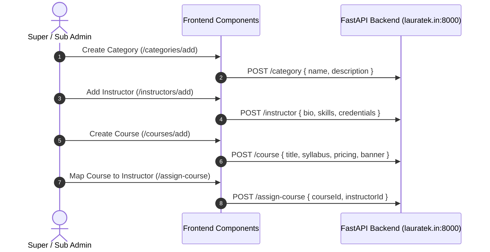
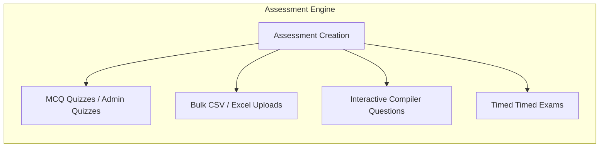

# Lauratek Admin & Sub-Admin Portal — End-to-End Architecture & Flow

Welcome to the comprehensive technical documentation and end-to-end workflow analysis for the **Lauratek Learning Management System (LMS) Admin Frontend**.

---

## 🏛️ 1. System Architecture & Tech Stack

This project is built as a **Single Page Application (SPA)** utilizing a modern enterprise frontend stack designed for high performance, modularity, and scalability.

| Layer | Technologies / Libraries Used | Purpose |
| :--- | :--- | :--- |
| **Core Framework** | **React 18**, **TypeScript**, **Vite 7** | Ultra-fast rendering, type safety, and instant HMR dev server |
| **Styling & UI** | **Tailwind CSS**, **shadcn/ui**, **Radix UI Primitive Components** | Accessible, responsive, glassmorphic & modern administrative UI |
| **Routing** | **React Router DOM v6** | Nested routing, protected guards, and seamless dual-portal navigation |
| **State & Fetching** | **TanStack Query v5 (React Query)**, **Axios** | Server-state caching, optimistic updates, and REST API communication |
| **Forms & Validation**| **React Hook Form**, **Zod** | Schema-validated form submissions across complex multi-step wizards |
| **Charts & Visuals** | **Recharts**, **Lucide React**, **Embla Carousel** | Interactive analytics dashboards, streak visualizations, and rich icons |

---

## 🔄 2. Dual-Portal Architecture Overview

A unique architectural aspect of this codebase is the unified dual-portal design. Both the **Super Admin Portal** and the **Sub-Admin Portal** reside within the same build, separated cleanly by routing prefixes and dedicated state structures:

```mermaid
graph TD
    Client[Web Browser] --> Router[React Router DOM v6]
    
    subgraph SuperAdminPortal [Super Admin Portal Prefix: /]
        Router --> Login["/ (Super Admin Login + TOTP/MFA)"]
        Login --> AdminGuard[ProtectedRoute Guard]
        AdminGuard --> AdminDash["/dashboard (Main Admin LMS Dashboard)"]
        AdminDash --> AdminModules[Users | Courses | Live Classes | Assessments | Certificates]
    end
    
    subgraph SubAdminPortal [Sub-Admin Portal Prefix: /subadmin/*]
        Router --> SubLogin["/subadmin-login (Sub-Admin Authentication)"]
        SubLogin --> SubGuard[SubAdmin ProtectedRoute Guard]
        SubGuard --> SubDash["/subadmin/dashboard (Sub-Admin Workspace)"]
        SubDash --> SubModules[Delegated Courses | Attendance | Students | Results]
    end
```

---

## 🧭 3. End-to-End System Workflows

### Phase 1: Authentication & Security (MFA & Token Management)
1. **Login Request**: User enters credentials (`email` and `password`) on `/` (Super Admin) or `/subadmin-login` (Sub-Admin).
2. **Multi-Factor Authentication (MFA)**:
   - For Super Admins, the system checks if TOTP MFA is enrolled via backend API (`https://lauratek.in:8000/admin/login`).
   - If unenrolled, the user is presented with a QR Code (`qrImage`) and backup codes for authenticator app enrollment.
   - If enrolled, an OTP or Backup Code challenge (`step: "mfa" | "backupCodes"`) must be satisfied.
3. **Session Interception**:
   - On successful authentication, an access JWT (`access_token`) is stored in `localStorage`.
   - Global Axios Interceptors (`src/subadmin/src/api/axiosInstance.ts`) automatically inject `Authorization: Bearer <token>` into all subsequent HTTP headers and handle `401 Unauthorized` responses by redirecting back to login.

---

### Phase 2: Curriculum Setup & Organization Lifecycle
Before enrolling students or conducting live classes, the foundational hierarchy must be established:



1. **Categories (`/categories`)**: Grouping courses by domain (e.g., Full Stack Development, Data Science, AI/ML).
2. **Instructors (`/instructors`)**: Registering faculty members with qualifications and profile avatars.
3. **Courses (`/courses`)**: Defining curriculum modules, duration, pricing, and prerequisites.
4. **Course Delegation (`/assign-course`)**: Linking specific instructors to teach dedicated courses.

---

### Phase 3: Student Onboarding & Enrollment Management
1. **User Registration (`/Allusers`, `/Students`, `/registered-users`)**:
   - Admins can onboard regular registered students or create guest candidates for walk-in/trial assessments.
2. **Course Assignment (`/assign-course-student`)**:
   - Students are mapped to active courses, granting them access to study materials, quizzes, and live classrooms.
3. **Enrollment Tracking (`/ADMINENROLLMENTS`)**:
   - Centralized tracking of active subscriptions, payment status, completion percentage, and student learning streaks (`/students/streak/:id`).

---

### Phase 4: Live Delivery & Recorded Content
1. **Live Classes (`/live-classes`)**:
   - Scheduling interactive streaming sessions with meeting links, date/time slots, and batch allocations.
2. **Recorded Lectures (`/recorded-videos`)**:
   - Uploading video assets (`VideoCard.tsx`, `UploadVideoForm.tsx`) for asynchronous student replay.
3. **Attendance Tracking (`/attendance`, `/attendance/add`)**:
   - Logging daily student presence/absence per session and generating historical attendance audit logs (`/attendance/details/:studentId`).

---

### Phase 5: Comprehensive Examination & Assessment Engine
The LMS supports both standard objective assessments and advanced coding challenges:



1. **Objective Quizzes (`/quizzes`, `/admin-quizzes`, `/GuestQUizzes`)**:
   - Creation of multiple-choice questions with time limits and automated grading.
   - Supports **Bulk Uploads** via modals (`BulkUploadAdminQuizModal.tsx`, `BulkUploadQuestionModal.tsx`) for rapid question import.
2. **Coding & Compiler Assessments (`/student-compiler-questions`, `/guest-compiler-questions`)**:
   - Real-time programming problem definitions with test cases, execution time constraints, and language restrictions.
3. **Timed Examinations (`/student-exams`, `/guest-exams`)**:
   - High-stakes evaluation combining multiple question formats into formal exam sittings.

---

### Phase 6: Outcomes, Performance Reviews & Credentialing
Once students complete courses and assessments, the system manages outcomes:
1. **Student Results (`/results`, `/Guest`)**: Aggregate scoring reports, pass/fail thresholds, and question-level breakdowns.
2. **Trainer & Student Reviews (`/reviews`, `/PerformanceReview`)**: Two-way feedback mechanism evaluating instructor effectiveness and student engagement metrics.
3. **Resume Builder (`/resumes`)**: Integrated tool allowing students and admins to construct and export formatted professional resumes based on completed skills.
4. **Certificate Generation (`/certificates`)**: Issuing verifiable completion certificates with unique IDs upon course graduation.

---

## 📂 4. Repository Structure Breakdown

```text
Admin_frontend_laura/
├── src/
│   ├── App.tsx                    # Main App Entry & Root Router configuration
│   ├── main.tsx                   # React DOM bootstrapping
│   ├── index.css                  # Global design system & Tailwind layers
│   ├── services/api/api.tsx       # Global backend API endpoint constant
│   ├── components/                # Reusable UI & Layout blocks
│   │   ├── layout/                # DashboardLayout, Sidebar, Header
│   │   └── ui/                    # Radix/Shadcn UI component library (Button, Dialog, etc.)
│   ├── pages/                     # Super Admin Portal Views
│   │   ├── Login.tsx              # MFA-enabled Super Admin Login
│   │   ├── Dashboard.tsx          # Main LMS Analytics & Metrics
│   │   ├── Courses.tsx / CourseForm.tsx
│   │   ├── Attendance.tsx / AttendanceForm.tsx
│   │   ├── LiveClasses.tsx / RecordedVideos.tsx
│   │   ├── Student.tsx / StudentForm.tsx / ViewStreak.tsx
│   │   ├── Certificates.tsx / Resume.tsx / Results.tsx
│   │   └── Services/              # Categories & Instructor management
│   └── subadmin/                  # Isolated Sub-Admin Portal Module
│       ├── src/
│       │   ├── App.tsx            # Sub-Admin dedicated router (/subadmin/*)
│       │   ├── api/               # Sub-Admin Axios instance with interceptors
│       │   ├── contexts/          # Sub-Admin AuthContext provider
│       │   ├── components/        # Sub-Admin Dashboard layout & navigation
│       │   └── pages/             # Delegated views (Quizzes, Attendance, Students)
```

---

## 🚀 5. Local Development & Deployment Guide

### Prerequisites
- **Node.js** (v18+ recommended)
- **npm** or **bun**

### 1. Installation
Clone the repository and install dependencies:
```bash
git clone <repository_url>
cd Admin_frontend_laura
npm install
```

### 2. Running the Development Server
Launch the instant Vite development server with hot module replacement:
```bash
npm run dev
```
- **Super Admin Portal**: `http://localhost:5173/`
- **Sub-Admin Portal**: `http://localhost:5173/subadmin-login`

### 3. API Configuration
By default, the application connects to the production FastAPI service:
```typescript
// Located in src/services/api/api.tsx & src/subadmin/src/api/axiosInstance.ts
export const API_BASE_URL = "https://lauratek.in:8000";
```
To point to a local backend instance during debugging, update `API_BASE_URL` to `http://localhost:8000`.

### 4. Production Build
Generate optimized static bundles for deployment:
```bash
npm run build
```
The compiled output will be generated inside the `/dist` directory, ready to be hosted on Netlify, Vercel, Firebase Hosting, or AWS S3/CloudFront.
